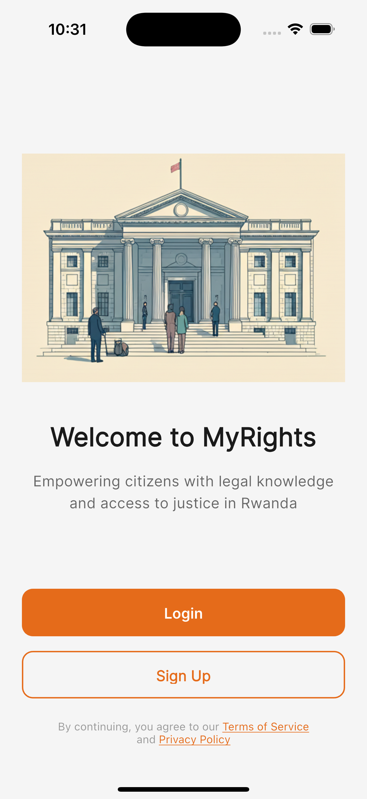
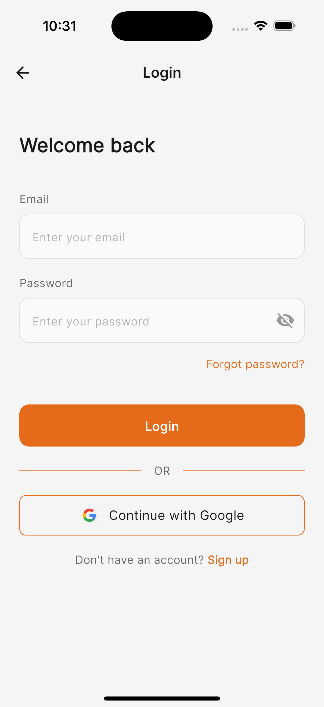
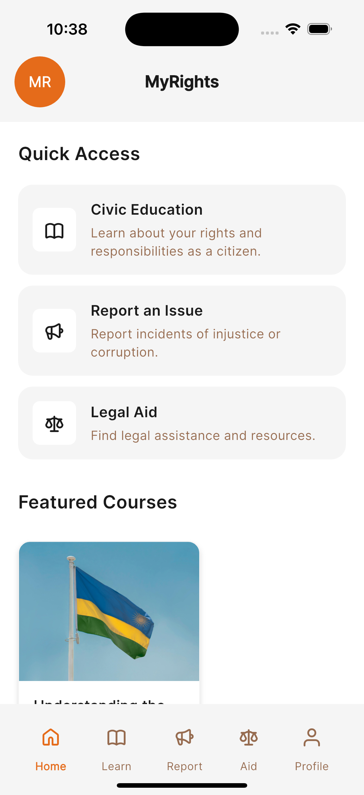
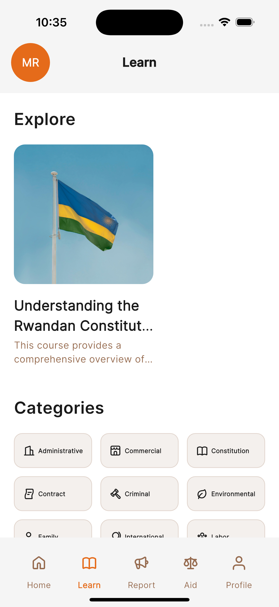
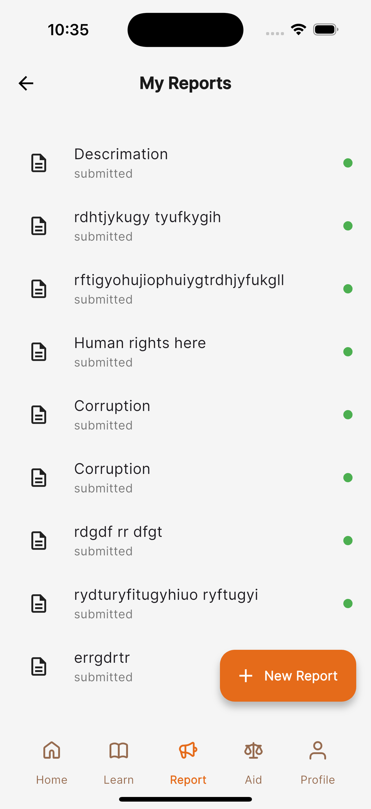
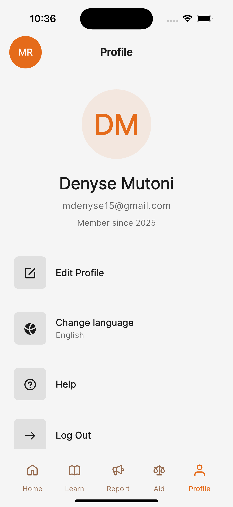
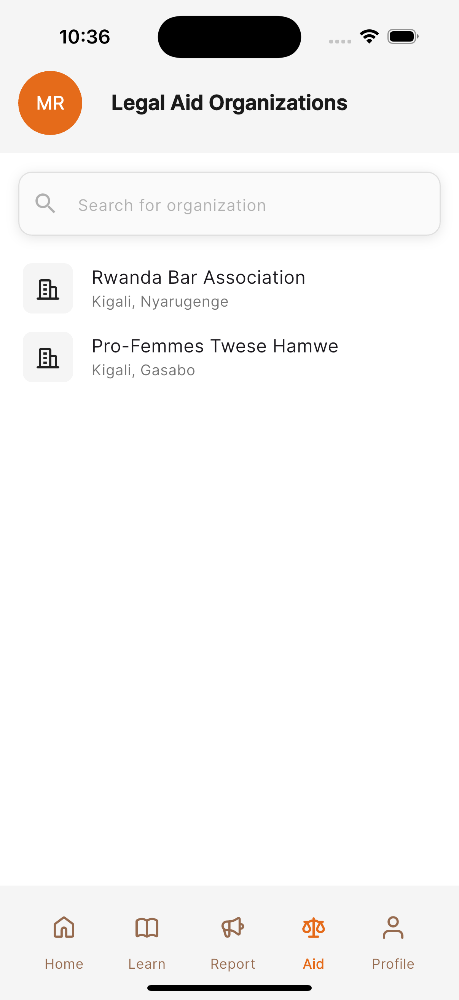
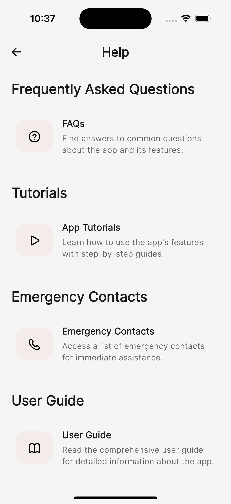

# MyRights Mobile App

Empowering Rwandan citizens with civic education, legal aid resources, and secure reporting mechanisms</strong>


## Overview

MyRights is a mobile application designed to empower Rwandan citizens with civic education, legal aid resources, and secure reporting mechanisms for abuses or corruption. It provides users with access to legal information and support services, educational resources for learning about their rights and responsibilities as citizens, and a platform to report issues directly to relevant authorities.

## Features

### Authentication & Security
•⁠  ⁠Secure user authentication with Firebase
•⁠  ⁠Google Sign-in integration
•⁠  ⁠Password reset functionality
•⁠  ⁠Encrypted data transmission

### Educational Resources
•⁠  ⁠Comprehensive civic education materials
•⁠  ⁠Interactive learning modules
•⁠  ⁠Rights and responsibilities guide
•⁠  ⁠Legal process explanations

### User-Friendly Interface
•⁠  ⁠Clean, intuitive design
•⁠  ⁠Responsive layout for all screen sizes
•⁠  ⁠Accessibility features

### Reporting System
•⁠  ⁠Anonymous reporting options
•⁠  ⁠Secure case tracking
•⁠  ⁠Evidence upload capabilities
•⁠  ⁠Real-time status updates

## Screenshots

| Welcome Screen   | Login Screen | Home Screen | Education Module | Reporting Feature |
|:---:|:---:|:---:|:---:|:---:|
|  |  |  |  |  |

| Profile Screen | Legal Resources | Support |
|:---:|:---:|:---:|
|  |  |  |


## Technology Stack

•⁠  ⁠*Framework*: Flutter 3.24.0+
•⁠  ⁠*Language*: Dart 3.5.0+
•⁠  ⁠*State Management*: Riverpod
•⁠  ⁠*Navigation*: GoRouter
•⁠  ⁠*Authentication*: Firebase Auth
•⁠  ⁠*Database*: Cloud Firestore

## Prerequisites

Before you begin, ensure you have the following installed:

•⁠  ⁠*Flutter SDK*: Version 3.24.0 or higher
•⁠  ⁠*Dart SDK*: Version 3.5.0 or higher
•⁠  ⁠*Android Studio*: Latest version
•⁠  ⁠*Xcode*: Latest version (for iOS development)
•⁠  ⁠*Firebase CLI*: For backend configuration

### System Requirements

#### For Android Development:
•⁠  ⁠Android SDK API level 23 or higher
•⁠  ⁠Android Studio Arctic Fox or newer
•⁠  ⁠Java Development Kit (JDK) 17

#### For iOS Development:
•⁠  ⁠macOS 10.15.7 or higher
•⁠  ⁠Xcode 13.0 or higher
•⁠  ⁠CocoaPods 1.11.0 or higher

## Setup Instructions

### 1. Clone the Repository
⁠ bash
git clone https://github.com/dmutoni/my_rights_mobile_app.git
cd my_rights_mobile_app
 ⁠

### 2. Install Dependencies
⁠ bash
# Get Flutter packages
flutter pub get

# For iOS (if developing for iOS)
cd ios && pod install && cd ..
 ⁠
### 3. Configure Firebase
•⁠  ⁠Create a Firebase project at [Firebase Console](https://console.firebase.google.com/)
•⁠  ⁠Add your Android and iOS apps to the Firebase project
•⁠  ⁠Enable Firebase Authentication and Firestore in the Firebase Console

#### Android Setup:
1.⁠ ⁠Download `google-services.json` from Firebase Console
2.⁠ ⁠Place it in the `android/app/` directory

#### iOS Setup:
1.⁠ ⁠Download `GoogleService-Info.plist` from Firebase Console
2.⁠ ⁠Place it in the `ios/Runner/` directory

### 4. Build and Run the Application

#### Debug Mode:
⁠ bash
# Run on connected device/emulator
flutter run

# Run on specific device
flutter run -d <device_id>
 ⁠

#### Release Mode:
⁠ bash
# Build APK for Android
flutter build apk --release

# Build iOS app
flutter build ios --release
 ⁠
## Development Setup

### Code Quality Tools

#### 1. Run Flutter Analyze
⁠ bash
flutter analyze
 ⁠
*Target*: 0 issues

#### 2. Code Formatting
⁠ bash
# Format all Dart files
flutter format .

# Check formatting
flutter format --dry-run .
 ⁠

#### 3. Testing
⁠ bash
# Run all tests
flutter test

# Run tests with coverage
flutter test --coverage

### Project Structure

lib/
├── core/                   # Core utilities and configurations
│   ├── router/           # Navigation configuration
│   ├── theme/            # App theming
│   └── utils/            # Helper functions
├── models/                 # Data models
├── providers/              # Riverpod state providers
├── screens/                # App screens
│   ├── aid/               # Legal aid resources
│   ├── auth/              # Authentication feature
│   ├── learn/             # Educational content
│   ├── incident_reporting/  # Reporting system
│   └── profile/            # User profile
├── services/               # External service integrations
├── shared/               # Shared widgets
│   ├── widgets/         # Reusable UI components
└── main.dart            # App entry point

## Code Standards

### Naming Conventions
•⁠  ⁠*Classes*: PascalCase (⁠ ProfileScreen ⁠)
•⁠  ⁠*Functions*: camelCase (⁠ getUserData ⁠)
•⁠  ⁠*Variables*: camelCase (⁠ isUserLoggedIn ⁠)
•⁠  ⁠*Files*: snake_case (⁠ profile_screen.dart ⁠)

### Code Organization
•⁠  ⁠Functions used for code reusability
•⁠  ⁠Clear and descriptive variable names
•⁠  ⁠Understandable code comments
•⁠  ⁠Consistent formatting with ⁠ flutter format ⁠
•⁠  ⁠Zero warnings from ⁠ flutter analyze 

## Deployment

### Android Deployment
⁠ bash
# Build signed APK
flutter build apk --release

# Build App Bundle (for Play Store)
flutter build appbundle --release
 ⁠

### iOS Deployment

# Build for iOS
flutter build ios --release

# Archive in Xcode for App Store submission

## Contributing

1.⁠ ⁠Fork the repository
2.⁠ ⁠Create your feature branch (⁠ git checkout -b feature/amazing-feature ⁠)
3.⁠ ⁠Commit your changes (⁠ git commit -m 'Add amazing feature' ⁠)
4.⁠ ⁠Push to the branch (⁠ git push origin feature/amazing-feature ⁠)
5.⁠ ⁠Open a Pull Request

### Code Review Checklist
•⁠  ⁠[ ] ⁠ flutter analyze ⁠ shows 0 issues
•⁠  ⁠[ ] All tests pass (⁠ flutter test ⁠)
•⁠  ⁠[ ] Code follows project naming conventions
•⁠  ⁠[ ] Functions are documented with comments
•⁠  ⁠[ ] Screenshots updated if UI changes made

<p align="center">
  Made with ❤️ for Rwanda 🇷🇼
</p>

---

## Flutter Analyze Results

```
$ flutter analyze
Analyzing my_rights_mobile_app...
No issues found!
```

*Result: 0 issues found*